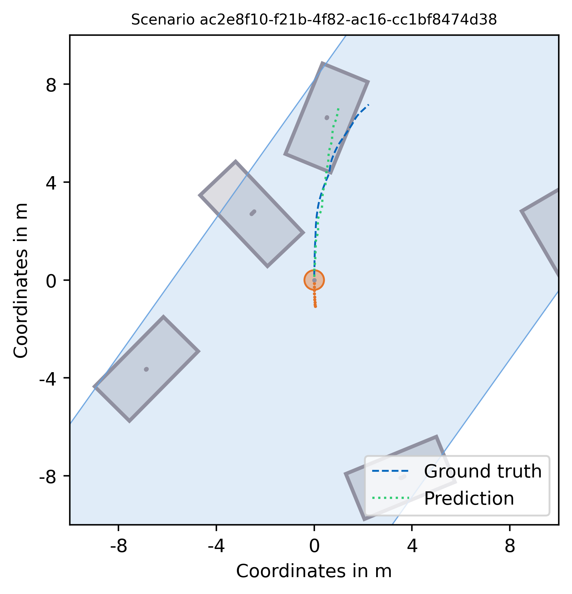

# Snapshot: Towards Application-centered Models for Pedestrian Trajectory Prediction in Urban Traffic Environments

This repository is the official implementation of [Snapshot](https://arxiv.org/abs/2409.01971) authored by Nico Uhlemann, Yipeng Zhou, Tobias Simeon Mohr and Markus Lienkamp.

## Table of Contents

* [News](#news)
* [ToDos](#todos)
* [Getting Started](#getting-started)
* [Training & Evaluation](#train_eval)
* [Pretrained Models & Results](#models_results)
* [Citation](#citation)
* [License](#license)

## News

**[2025/01/15]** Release of the initial version, containing all necessary scripts for data processing, model training and evaluation.

## ToDos

- [ ] Add images
- [ ] Adjust plot script in media
- [ ] Add citation once paper is published

## Getting Started

**Step 1**: Clone this repository

```
git clone https://github.com/TUMFTM/Snapshot.git && cd Snapshot
```

**Step 2**: Setup a virtual environment and install dependencies

```
python3 -m venv <your_env_name>
source <your_env_name>/bin/activate
pip install -r requirements.txt
```
Alternatively, create a dedicated [Argoverse2](https://github.com/argoverse/av2-api) environment using conda.
For the subsequent commands to work properly, it is expected that you're in the Snapshot root directory which should be the case if you followed the steps above. There is no need to change to a different directoy from this point onwards when executing files.

**Step 3**: Download the Argoverse2 Motion Forecasting Dataset

Download the [Argoverse2 Motion Forecasting Dataset](https://www.argoverse.org/av2.html) and place it within the directory `dataset/Argoverse2/motion_forecasting`. For that, you can use the script `dataset/download.sh` contained in this repository. Make sure to adjust the TARGET_DIR variable within the script to specify the path to your repository and to install s5cmd beforehand.
For more detailed instructions, please refer to the [Argoverse2 User Guide](https://argoverse.github.io/user-guide/getting_started.html).

**Step 4**: Create the pedestrian benchmark and preprocess the data

Using the script `dataset/main.py`, the original Argoverse 2 dataset is processed to focus on the prediction of pedestrians. Through this process, the benchmark described in our publication is setup and the corresponding samples as well as map files are stored within `dataset/Argoverse2/pedestrian_benchmark`. Afterwards, the generated samples are automatically preprocessed to be used alongside the provided Snapshot implementation. By default, the preprocessed samples are stored in `dataset/Argoverse2/preprocessed`. The processing in general can be adjusted through the corresponding parameters in the `config.yaml`, especially the number of cores employed.

## Training & Evaluation <a name="train_eval"></a>
The preprocessing is executed when running `dataset/main.py`. For a separate executing, `dataset/Data_Preprocessing.py` can be called. If you ran the script already previously and hence the folder `dataset/Argoverse2/preprocessed` exists, the preprocessing will not be executed again unless either the storage location in `config.yaml` is changed or the corresponding directory removed.

Now the training can be started by executing `model/train.py`. This will start the training run based on the parameters defined in the config. After the training process finished, the testing is automatically conducted. To run it separately, one can start it via

```
python3 model/test.py model/weights/snapshot_main.pth
```

## Pretrained Models & Results <a name="models_results"></a>

The weights for the pretrained models achieving the results reported in the paper as well as below can be found in the directory `/model/weights`. Here, `snapshot_main.pth` referces to the main model presented in the publication. Alongside, `snapshot_scratch.pth` contains the weights for the training from scratch and `snapshot_10s.pth` as well as `snapshot_2ts.pth` are optimized models for 10 and 2 timesteps, respectively.

### Quantitative Results

The results below are reported on the pedestrian benchmark which was generated based on the original [Argoverse2 Motion Forecasting Dataset](https://www.argoverse.org/av2.html).

| Model | | CVM | SIMPL | Forecast-MAE | QCNet | Snapshot (2ts) | Snapshot (10ts) |
| :---: | :---: | :---: | :---: | :---: | :---: | :---: | :---: |
| Test | ADE| 0.793 | 0.699 | 0.698 | 0.693 | 0.617 | 0.567 |
| Test | FDE| 1.776 | 1.557 | 1.435 | 1.474 | 1.342 | 1.251 |

### Qualitative Results

To visualize the trajectories for different scenes and different models, `/media/visualization.py` provides a basic implementation for the preprocessed data. Selected scenes generated with this script are displayed below, with the blue line representing the ground truth, yellow the prediction of Snapshot and green the CVM.

Scenario 1 | Scnario 2
 :-------------------------:|:-------------------------:
 | 


## Citation <a name="citation"></a>

If you found this repository useful, please consider citing our work:
@inproceedings{uhlemann.2025snapshot,
      title={Snapshot: Towards Application-centered Models for Pedestrian Trajectory Prediction in Urban Traffic Environments}, 
      author={Nico Uhlemann and Yipeng Zhou and Tobias Mohr and Markus Lienkamp},
      year={2025},
      publisher={IEEE},
      booktitle={2025 IEEE/CVF Winter Conference on Applications of Computer Vision Workshops}
}

## License <a name="license"></a>

This repository is licensed under [Apache 2.0](LICENSE).
